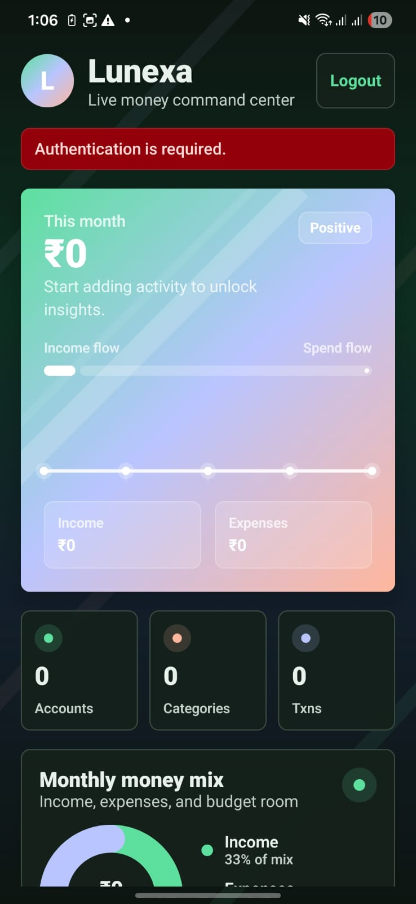
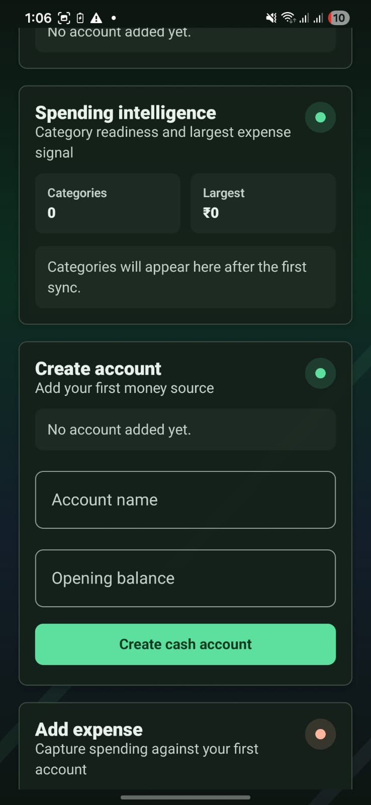
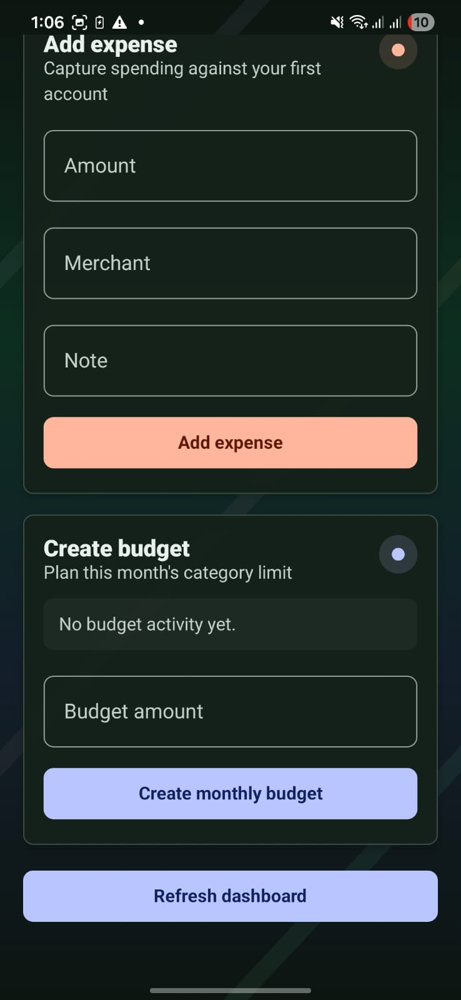
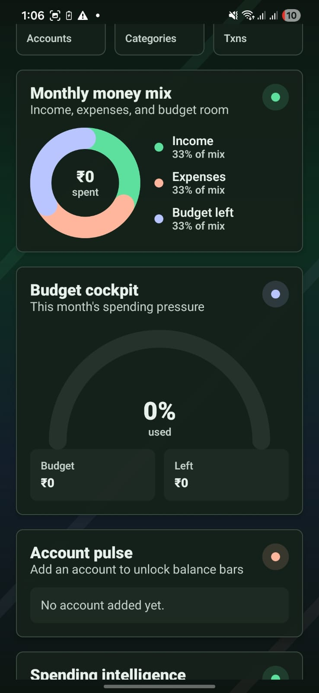
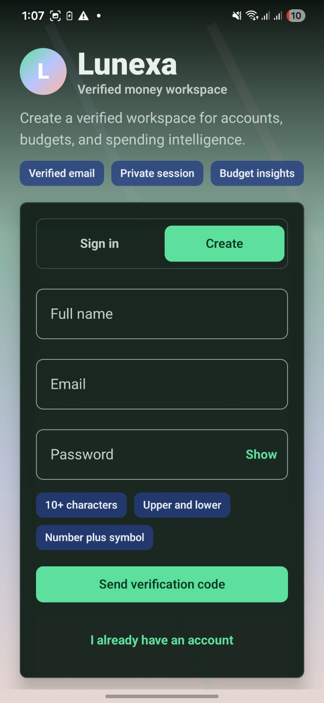
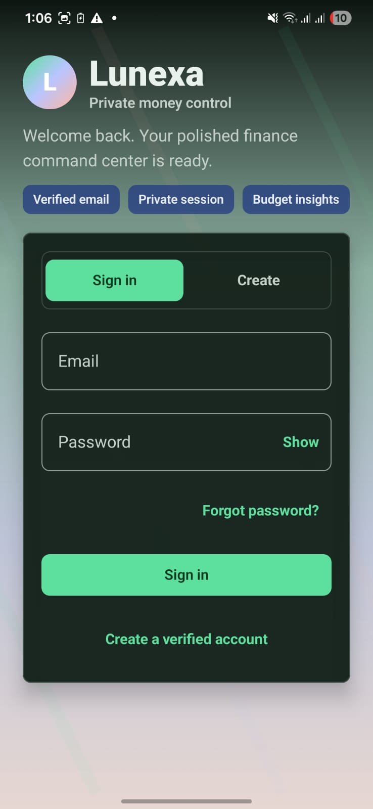

# Lunexa - Personal Finance Tracker

A modern, full-stack personal finance tracking application with a native Android client and serverless backend.

[](https://android.com)
[](https://kotlinlang.org)
[](https://developer.android.com/jetpack/compose)
[](LICENSE)

## Overview

Lunexa helps you track your personal finances with features including:
- Multi-account management (cash, bank, wallet, credit cards, investments)
- Transaction tracking with categories
- Monthly budget management with alerts
- Financial analytics and reporting
- Secure authentication with email verification

## Screenshots

<div align="center">

### Authentication Flow
<table>
  <tr>
    <td align="center"><b>Sign In / Register</b></td>
    <td align="center"><b>Email Verification</b></td>
  </tr>
  <tr>
    <td></td>
    <td></td>
  </tr>
</table>

### Main Features
<table>
  <tr>
    <td align="center"><b>Home Dashboard</b></td>
    <td align="center"><b>Accounts</b></td>
    <td align="center"><b>Transactions</b></td>
  </tr>
  <tr>
    <td></td>
    <td></td>
    <td></td>
  </tr>
  <tr>
    <td align="center"><b>Budget</b></td>
    <td colspan="2"></td>
  </tr>
  <tr>
    <td></td>
    <td colspan="2"></td>
  </tr>
</table>

</div>

## Architecture

Lunexa follows a modular, Clean Architecture approach:

### Tech Stack

| Component | Technology |
|-----------|-----------|
| **UI Framework** | Jetpack Compose with Material 3 |
| **Language** | Kotlin 2.2.10 |
| **Dependency Injection** | Hilt (Dagger) |
| **Async** | Coroutines + Flow |
| **Database** | Room (local cache) |
| **Networking** | Retrofit + OkHttp |
| **Navigation** | Jetpack Navigation Compose |
| **Min SDK** | Android 8.0 (API 24) |
| **Target SDK** | Android 14 (API 36) |

### Module Structure

```
Lunexa/
├── app/                    # Main application module
├── core-common/            # Shared utilities & extensions
├── core-ui/                # Shared UI components & theme
├── core-network/           # API client, auth, DTOs
├── core-database/          # Room database setup
├── feature-auth/           # Authentication flow
├── feature-home/           # Dashboard & home
├── feature-transactions/   # Transaction management
├── feature-budget/         # Budget tracking
└── feature-analytics/      # Analytics & reports
```

### Dependency Graph

```
:app
  └─→ :feature-* (all feature modules)
  └─→ :core-ui
  └─→ :core-network
  └─→ :core-database
  └─→ :core-common

:feature-*
  └─→ :core-ui
  └─→ :core-network
  └─→ :core-database
  └─→ :core-common
```

## Features

### Authentication
- Email registration with verification
- JWT-based authentication (access + refresh tokens)
- Password reset flow
- Secure token storage and automatic refresh

### Accounts
- Multiple account types (Cash, Bank, Wallet, Credit Card, Investment)
- Multi-currency support
- Account archiving

### Transactions
- Income, expense, and transfer transactions
- Category-based organization
- Merchant tracking
- Notes and metadata support

### Budgets
- Monthly budget limits per category
- Configurable alert thresholds
- Budget vs. actual tracking

### Analytics
- Monthly spending summaries
- Category-wise breakdowns
- Visual trends and insights

## Setup

### Prerequisites

- Android Studio Hedgehog or later
- JDK 11 or higher
- Android SDK 36

### Backend Setup

The backend must be running first. See [backend/README.md](backend/README.md) for instructions.

### 1. Clone the Repository

```bash
git clone https://github.com/vardhanyadav1714/Lunexa.git
cd Lunexa
```

### 2. Configure API Base URL

Create `local.properties` in the project root:

```properties
# For local development
api.base.url=http://10.0.2.2:8787/api/v1

# For production
# api.base.url=https://lunexa-api.vardhanyadav01001.workers.dev/api/v1
```

### 3. Build the Project

```bash
./gradlew build
```

### 4. Run the App

```bash
./gradlew installDebug
# Or run from Android Studio
```

## Development

### Running Tests

```bash
# Unit tests
./gradlew test

# Instrumented tests
./gradlew connectedAndroidTest
```

### Code Style

This project follows Kotlin coding conventions:
- 4-space indentation
- Expression body for single-expression functions
- Immutable data classes for state
- Coroutines for async operations

## Architecture Patterns

### MVVM with StateFlow

```kotlin
@HiltViewModel
class AuthViewModel @Inject constructor(
    private val repository: AuthRepository
) : ViewModel() {
    private val _uiState = MutableStateFlow(AuthUiState())
    val uiState: StateFlow<AuthUiState> = _uiState

    fun onEmailChange(value: String) {
        _uiState.update { it.copy(email = value, errorMessage = null) }
    }
}
```

### Repository Pattern

```kotlin
class AuthRepository @Inject constructor(
    private val apiService: LunexaApiService,
    private val tokenStore: AuthTokenStore
) {
    suspend fun login(email: String, password: String) {
        val response = apiService.login(LoginRequest(email, password))
        tokenStore.saveTokens(response.data.tokens)
    }
}
```

### Dependency Injection

```kotlin
@Module
@InstallIn(SingletonComponent::class)
object NetworkModule {
    @Provides
    @Singleton
    fun provideApiService(
        retrofit: Retrofit
    ): LunexaApiService = retrofit.create(LunexaApiService::class.java)
}
```

## API Integration

### Authentication

All authenticated requests include the access token:

```kotlin
@POST("api/v1/auth/login")
suspend fun login(@Body request: LoginRequest): ApiEnvelope<AuthPayloadDto>
```

### Token Refresh

The `AuthInterceptor` automatically refreshes tokens on 401 responses:

```kotlin
override fun intercept(chain: Interceptor.Chain): Response {
    val response = proceedWithAuth(chain)
    if (response.code == 401) {
        return refreshTokenAndRetry(chain)
    }
    return response
}
```

## Security

- Passwords hashed with PBKDF2-SHA256
- JWT tokens with short-lived access tokens (15 min)
- Refresh tokens with 30-day expiry
- HTTPS required in production
- Email verification for account creation

## Roadmap

- [ ] Recurring transactions
- [ ] Bill reminders
- [ ] Export to CSV/PDF
- [ ] Dark mode improvements
- [ ] Biometric authentication
- [ ] Widget support

## Contributing

Contributions are welcome! Please feel free to submit a Pull Request.

## License

```
MIT License

Copyright (c) 2026 Vardhan Yadav

Permission is hereby granted, free of charge, to any person obtaining a copy
of this software and associated documentation files (the "Software"), to deal
in the Software without restriction, including without limitation the rights
to use, copy, modify, merge, publish, distribute, sublicense, and/or sell
copies of the Software, and to permit persons to whom the Software is
furnished to do so, subject to the following conditions:

The above copyright notice and this permission notice shall be included in all
copies or substantial portions of the Software.

THE SOFTWARE IS PROVIDED "AS IS", WITHOUT WARRANTY OF ANY KIND, EXPRESS OR
IMPLIED, INCLUDING BUT NOT LIMITED TO THE WARRANTIES OF MERCHANTABILITY,
FITNESS FOR A PARTICULAR PURPOSE AND NONINFRINGEMENT. IN NO EVENT SHALL THE
AUTHORS OR COPYRIGHT HOLDERS BE LIABLE FOR ANY CLAIM, DAMAGES OR OTHER
LIABILITY, WHETHER IN AN ACTION OF CONTRACT, TORT OR OTHERWISE, ARISING FROM,
OUT OF OR IN CONNECTION WITH THE SOFTWARE OR THE USE OR OTHER DEALINGS IN THE
SOFTWARE.
```

## Author

**Vardhan Yadav**
- GitHub: [@vardhanyadav1714](https://github.com/vardhanyadav1714)

## Acknowledgments

- [Android Architecture Blueprints](https://github.com/android/architecture-samples)
- [Jetpack Compose Samples](https://github.com/android/compose-samples)
- [Hilt Documentation](https://developer.android.com/training/dependency-injection/hilt-android)
