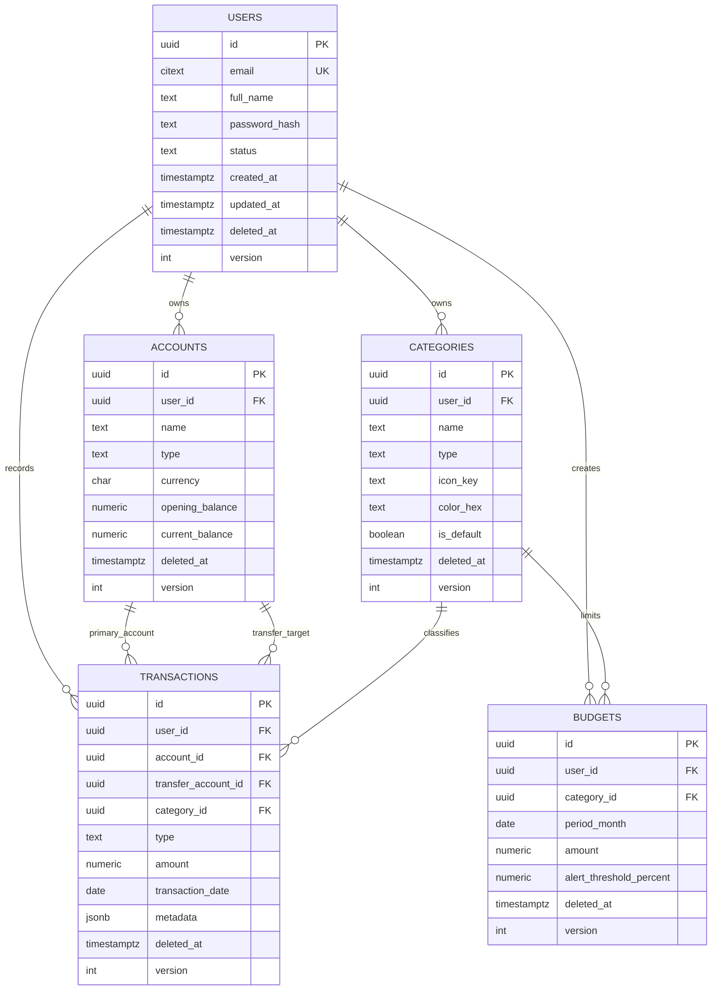

# Lunexa PostgreSQL Schema

This schema is designed for a production-style personal finance app with user-owned data, soft deletes, audit fields, strong foreign keys, and indexes for common mobile/API query patterns.

## ER Diagram



## SQL Schema

The executable schema lives in:

```text
backend/db/schema.sql
```

## Design Explanation

All domain tables use UUID primary keys. This works well for offline-first mobile clients because the Android app can create stable IDs before syncing with the backend.

Every table has audit fields:

```text
created_at
updated_at
deleted_at
created_by
updated_by
deleted_by
version
```

`deleted_at` provides soft delete support. Application queries should treat `deleted_at IS NULL` as the active-record filter. Partial indexes are built around that filter so active-list queries remain fast as soft-deleted rows accumulate.

`version` is incremented by a Postgres trigger on every update. This gives the backend a simple optimistic-concurrency field for future sync/conflict handling.

Categories are user-owned instead of globally shared. Default categories should be copied for each user during onboarding with `is_default = true`. This allows PostgreSQL to enforce ownership using composite foreign keys such as:

```text
(account_id, user_id) -> accounts(id, user_id)
(category_id, user_id) -> categories(id, user_id)
```

That prevents a transaction or budget from accidentally referencing another user's account/category.

## Important Indexes

User login:

```text
ux_users_email_active
```

Account list and unique account names:

```text
ux_accounts_user_name_active
idx_accounts_user_active
idx_accounts_user_type_active
```

Category list and unique category names:

```text
ux_categories_user_type_name_active
idx_categories_user_type_active
idx_categories_user_default_active
```

Transaction feeds, filters, and analytics:

```text
idx_transactions_user_date_active
idx_transactions_account_date_active
idx_transactions_category_date_active
idx_transactions_type_date_active
idx_transactions_transfer_account_active
idx_transactions_metadata_gin
```

Budget lookup:

```text
ux_budgets_user_category_month_active
idx_budgets_user_month_active
```

## Entity Notes

`users` stores identity and authentication metadata. `email` uses `CITEXT` so email uniqueness is case-insensitive.

`accounts` stores cash, bank, wallet, credit card, investment, and other account types. `opening_balance` is the initial value. `current_balance` is a cached value that the backend should update transactionally when transactions change.

`categories` stores income and expense categories. The `is_default` flag distinguishes seeded categories from user-created custom categories.

`transactions` stores income, expense, and transfer records. Amounts are always positive; the `type` field determines meaning. Transfers require `transfer_account_id`, and income/expense rows require it to be null.

`budgets` stores monthly category budgets. `period_month` must be the first day of the month, which makes budget queries simple and index-friendly.
